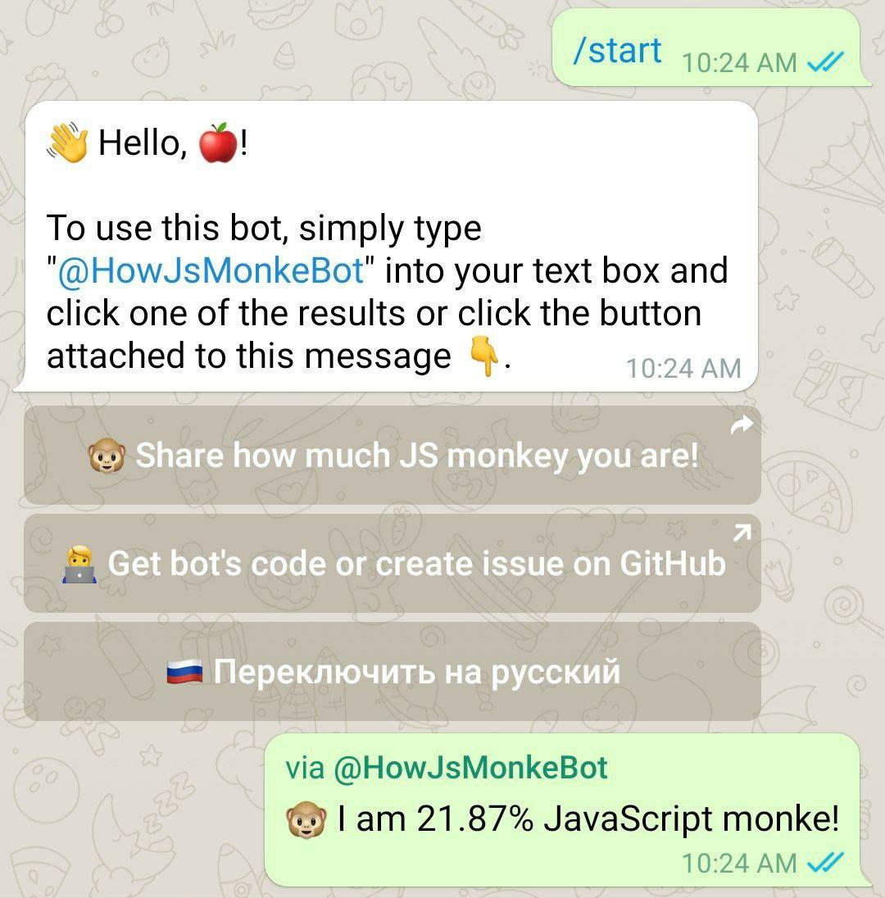

<br>
<p align="center">
  
</p>

<h1 align="center">@HowJsMonkeBot</h1>
<p align="center">
  How Much JavaScript Monke You Are?
</p>

<h2>👀 Preview</h2>
Check out telegram bot here ~> https://t.me/HowJsMonkeBot

<p align="center">
  
</p>

<h2>🚀 Installation</h2>

Clone repository

```
git clone https://github.com/martiliones/HowJsMonkeYouAreBot.git && cd HowJsMonkeYouAreBot
```

Downloads dependencies

```
npm install
```

Setup token

```
echo "TOKEN=*YOUR-TOKEN-FROM-BOT-FATHER*" > .env
```

Run bot

```
npm run start
```
